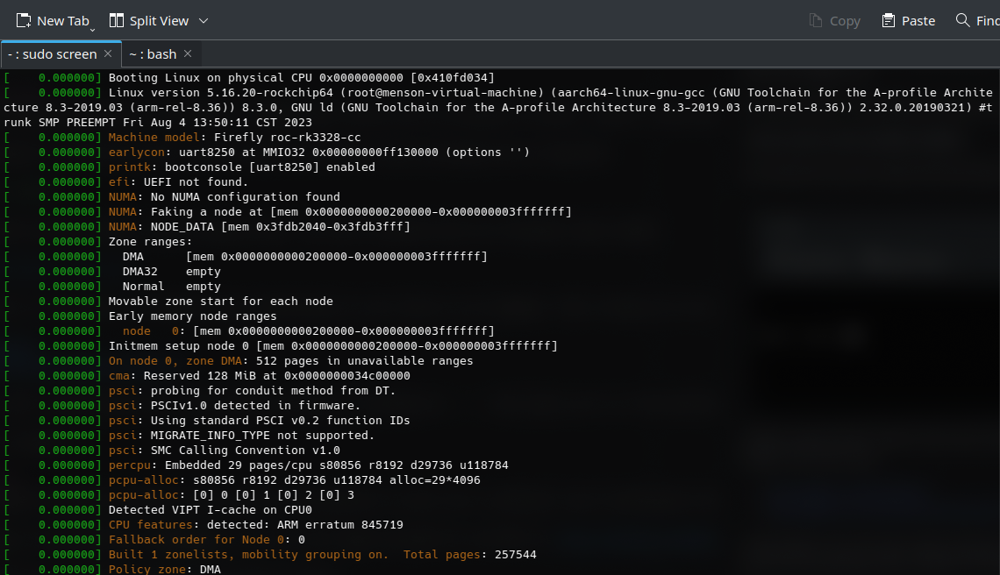

# Sovol SV07 Boot Fix
Sovol has recently released updates for their SV07 and SV07 Plus printers. For some folks, this update has caused their Klipper boads to brick. Luckily, it is possible to un-brick them without any special hardware.

## Requirements
* Bricked SV07 / SV07 Plus Klipper Unit
* USB-C Cable (for connecting to a PC)
* USB Thumb Drive (8GB minimum)

## Connecting to the Klipper Unit
Despite the Klipper unit not showing anything on its display, communication should still be possible via UART. Connect a USB cable to the bottom right female USB-C port on the Klipper Unit.

On Linux systems, it is possible to access the unit's serial console via screen (root privileges may be required):

```sudo screen /dev/ttyUSB0 1500000```

You should end up with a blank terminal window. After pressing enter, you may be greeted with the following login prompt:


Getting a login prompt? Great! In this case, the Armbian Linux installation on your board is not damaged. There already are two excellent tutorials on reviving the Klipper Unit for this case:

* https://github.com/fryc88/sv07
* https://github.com/TomasOlsson/BrickedSv07-Sv07Plus

Unfortunately, if you don't get a login prompt but a shell where the cursor is prefixed by `=>`, that means you're in the bootloader of the Klipper unit and it is unable to boot into the operating system (Armbian with Makerbase customizations) that is flashed onto the eMMC.

Don't worry, though! This is fixable :)

## Preparing a boot USB-Drive
The SV07's Klipper board supports booting from USB. We can use this functionality to boot into a different Linux installation that we can then leverage to fix the broken install on the eMMC.

Since the board used by Sovol is manufactured by Makerbase, we can use the image provided for the MKS Pi: https://github.com/makerbase-mks/MKS-PI#software-preparation. Download the latest image version available (currently `Armbian-makerbase-k5.16.20-EN-20230728.img.zip`).

Before flashing the image onto your USB drive, make sure to unzip it first!

You can use any software you like to flash the image. I recommend using [Balena Etcher](https://etcher.balena.io) as it makes this process fairly easy.

Should you prefer to flash the image via terminal, you can also use `dd`:

``sudo dd if=Armbian-makerbase-k5.16.20-EN-20230728.img of=/dev/$YOUR_USB_DRIVE bs=1M && sync``

Eject the USB drive from your PC and plug it into the top right of the Klipper unit. Then, power cycle the unit by removing both power and USB cable for a few seconds until the LEDs turn off. Plug them back in afterwards.

## Booting into Armbian
If your USB stick has been detected by U-Boot, Linux kernel messages should appear after a couple of seconds:



The printer should eventually show a Makerbase boot logo on its screen. Once it has finished booting, you should finally get that sweet login prompt from earlier!

Use the following credentials to log in:

* Username: `mks`
* Password: `makerbase`

Then, elevate your privileges to root by running:

`sudo -i`

You may be prompted to enter the password again.

## Accessing the internal eMMC
In order to access the Armbian installation that's burned onto the board, we need to mount the eMMC first. Run the following commands:

```
mount /dev/mmcblk1p2 /mnt
mount /dev/mmcblk1p1 /mnt/boot
```

In the following, we'll use `chroot` to enter the Linux installation that's on the eMMC. Before we do that, we need to set up some Kernel interfaces first:

```
mount -t proc none /mnt/proc
mount --rbind /sys /mnt/sys
mount --rbind /dev /mnt/dev
```

Then, it's finally time to chroot!

```
chroot /mnt
```

## Fixing things
We're almost at the finish line now.

Once you've chrooted into Sovol's Linux installation, switch to the root user's folder by running:

```cd /root```

List the directory's contents by running:

```ls```

In there, you should see an `armbian-update.deb` that the Unit has copied off your USB drive while you were trying to do the update. Install the update package by running:

```dpkg -i armbian-update.deb```

It may warn you that some files may already exist on the system. Tell dpkg to just overwrite them.

The root directory should also contain a `system_deb/` folder. Switch into this one by running the following command:

```cd /root/system_deb```

Then reinstall the kernel by running:

```dpkg -i linux-image-edge-rockchip64_22.05.0-trunk_arm64.deb```

This may take a minute or two. Don't worry if it is stuck at `generating initrafmfs` for a while - that's totally normal!

## Congratulations!
Once the kernel image has finished installing, you should be good to go! Power off the Klipper unit by disconnecting it from all cables. Then, remove your USB thumb drive. Plug power back in. It should now be able to boot again from eMMC!